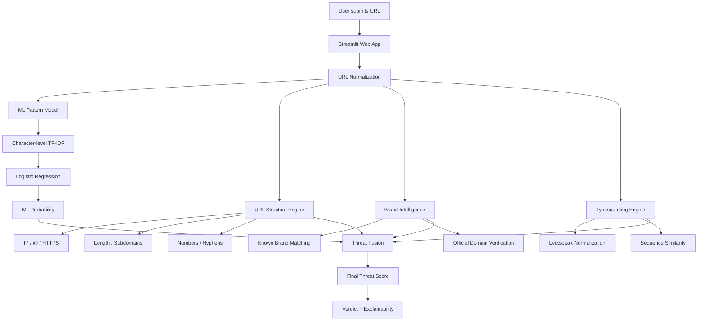
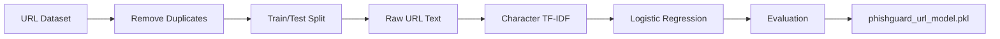

# 🛡️ PhishGuard

### AI-assisted phishing URL detection with explainable security intelligence


> **PhishGuard combines machine learning, URL structure analysis, brand intelligence, and typosquatting detection to provide an explainable phishing-risk assessment — without external threat-intelligence APIs.**

---

## 1. 📌 Overview

PhishGuard is a machine-learning-based web application designed to identify potentially malicious and phishing URLs.

The project combines a **character-level URL classification model** with deterministic security heuristics, known-brand detection, and typosquatting analysis. Instead of relying on a single ML probability, PhishGuard provides a layered assessment with evidence explaining why a URL was classified as low risk, suspicious, or high risk.

I built PhishGuard to explore how practical cybersecurity detection can combine **ML pattern recognition with interpretable security signals**, while keeping the project lightweight, reproducible, and free from paid threat-intelligence APIs.

---

## 2. 🚀 Live Demo / Screenshots / Video

| Resource | Link |
|---|---|
| 🌐 **Live Demo** | `[Add Streamlit Cloud URL]` |
| 🎥 **Demo Video** | `[Add demo video URL]` |
| 🖼️ **Screenshots / GIF** | `[Add screenshots or GIF URL]` |

### 📸 Screenshots

| Main Scanner | Threat Assessment |
|---|---|
|  |  |

| Brand & Typosquatting | Explainability |
|---|---|
|  |  |

> Replace the placeholder image paths above with screenshots from the deployed application.

---

## 3. ✨ Key Features

- ✅ **Character-level ML phishing detection** using raw URL text
- ✅ **97.17% test accuracy** on the final URL classification model
- ✅ **URL structural analysis** for common phishing indicators
- ✅ **Brand impersonation detection** across a curated list of known brands
- ✅ **Typosquatting detection** using character similarity
- ✅ **Leetspeak normalization** to detect substitutions such as `paypa1` → `paypal`
- ✅ **Suspicious keyword detection** for login, verification, payment, account, and security-related language
- ✅ **Explainable threat assessment** showing the signals behind the result
- ✅ **Multi-layer score fusion** instead of relying solely on the ML probability
- ✅ **Interactive Streamlit interface** with demo URLs and dark/light mode
- ✅ **No external threat-intelligence API required**
- ✅ **Privacy-conscious URL analysis** without visiting the submitted website

---

## 4. 🧰 Tech Stack

| Category | Technology |
|---|---|
| Frontend / UI | Streamlit |
| Backend / Application Logic | Python |
| AI / ML | scikit-learn |
| Feature Representation | Character-level TF-IDF |
| Classifier | Logistic Regression |
| Security Intelligence | Python heuristics + regex |
| Brand Detection | Curated known-brand domain list |
| Typosquatting | `difflib.SequenceMatcher` + leetspeak normalization |
| Model Serialization | Joblib |
| Data Processing | Pandas, NumPy |
| Visualization / Analysis | Matplotlib, Seaborn |
| Development | Google Colab |
| Version Control | GitHub |
| Deployment | Streamlit Cloud |
| External APIs | None |

---

## 5. 🏗️ Architecture / System Design

PhishGuard follows a layered detection architecture:

1. **Input** — the user submits a URL through the Streamlit interface.
2. **ML Pattern Model** — the raw URL is passed through a character-level TF-IDF vectorizer and Logistic Regression classifier.
3. **URL Structure Engine** — deterministic rules inspect URL characteristics such as IP usage, `@` symbols, long domains, subdomains, numbers, hyphens, and HTTPS.
4. **Brand Intelligence** — the domain is compared against a curated set of known brands and official domains.
5. **Typosquatting Engine** — character similarity and leetspeak normalization identify lookalike domains.
6. **Threat Fusion** — the independent signals are combined into a final threat score and verdict.
7. **Explainability Layer** — the application presents the detected evidence to the user.



### ML Training Pipeline



---

## 6. 📁 Project Structure

```text
phishguard/
│
├── app.py
│   └── Streamlit web application and interactive UI
│
├── phishguard_engine.py
│   └── ML inference, structural analysis, brand intelligence,
│       typosquatting detection, scoring and explainability
│
├── phishguard_url_model.pkl
│   └── Trained character-level TF-IDF + Logistic Regression pipeline
│
├── requirements.txt
│   └── Python dependencies required by the deployed application
│
├── README.md
│   └── Project documentation
│
└── docs/
    └── screenshots/
        └── Optional project screenshots / GIFs
```

---

## 7. ⚙️ Getting Started — Installation

### Prerequisites

- Python 3.10+
- Git
- `pip`

### 1. Clone the repository

```bash
git clone https://github.com/<your-username>/phishguard.git
cd phishguard
```

### 2. Create a virtual environment

#### Windows

```bash
python -m venv .venv
.venv\Scripts\activate
```

#### macOS / Linux

```bash
python3 -m venv .venv
source .venv/bin/activate
```

### 3. Install dependencies

```bash
pip install -r requirements.txt
```

### 4. Run the application

```bash
streamlit run app.py
```

The application will open in your browser at the local Streamlit address shown in the terminal.

> **Note:** The repository already contains the trained `.pkl` model, so local users do not need to retrain the model just to run the application.

---

## 8. 🔐 Environment Variables

PhishGuard currently requires **no environment variables or API keys**.

| Variable | Required | Example | Description |
|---|---:|---|---|
| None | No | — | No `.env` configuration is required |

This is intentional: the application does not depend on paid external threat-intelligence APIs.

---

## 9. 🖥️ Usage

### Basic workflow

1. Open the PhishGuard application.
2. Paste a URL into the scanner.
3. Click **Analyze URL**.
4. Review:
   - Threat score
   - ML score
   - Security intelligence score
   - Domain status
   - URL anatomy
   - Brand impersonation
   - Typosquatting matches
   - Suspicious keywords
   - Structural security findings
5. Expand **"Why did PhishGuard give this score?"** to inspect the reasoning.

### Example inputs

```text
https://google.com
```

Expected behavior: recognized official domain → **Verified Low Risk**

```text
https://paypa1.com
```

Expected behavior: PayPal lookalike / leetspeak substitution → **High Risk**

```text
http://paypal-login-verify.com
```

Expected behavior: brand impersonation + suspicious authentication language → **High Risk**

```text
http://paypal.com@evil-site.com/login
```

Expected behavior: deceptive `@` URL structure and suspicious path → **High Risk**

> Results are model- and rule-based assessments and should not be treated as proof of safety or maliciousness.

---

## 10. 🔌 API Reference

**Not applicable.**

PhishGuard currently exposes a Streamlit web interface rather than a REST API.

The core Python inference function is:

```python
from phishguard_engine import analyze_url

result = analyze_url("https://example.com")
print(result)
```

The returned analysis contains fields including:

```text
verdict
score
ml_score
intelligence_score
trusted_domain
brand_impersonation
typosquatting
suspicious_keywords
security_findings
intelligence_reasons
```

---

## 11. 🤖 AI / ML

### Dataset

PhishGuard was trained using the following public URL phishing dataset:

**Hassan-Albattra — URL Phishing Detection Dataset**

Dataset source:

```text
https://raw.githubusercontent.com/Hassan-Albattra/URL_Phishing_Detection_Dataset/main/balanced_urls.csv
```

The dataset contained approximately **340,000 URLs**, with balanced phishing and legitimate classes.

After duplicate removal:

- **339,723 unique URLs**
- **170,000 legitimate**
- **169,723 phishing**

### Data Preprocessing

The final model uses the **raw URL string** rather than only handcrafted numerical features.

Preprocessing included:

1. Loading the URL dataset.
2. Checking missing values.
3. Removing duplicate URLs.
4. Separating URL text and labels.
5. Performing a stratified train/test split.
6. Converting raw URLs into character-level TF-IDF features.
7. Training the classifier.
8. Evaluating performance on the held-out test set.
9. Serializing the complete pipeline using Joblib.

### Model Architecture

The final model is a scikit-learn pipeline:

```python
Pipeline([
    (
        "tfidf",
        TfidfVectorizer(
            analyzer="char",
            ngram_range=(3, 5),
            min_df=2,
            max_features=100000,
            sublinear_tf=True
        )
    ),
    (
        "classifier",
        LogisticRegression(
            max_iter=1000,
            class_weight="balanced",
            n_jobs=-1
        )
    )
])
```

### Why Character-Level TF-IDF?

URLs contain useful character-level patterns such as:

- unusual character sequences
- deceptive domain structures
- suspicious separators
- repeated tokens
- authentication-related paths
- domain mutations

Character n-grams allow the model to learn these patterns without requiring a manually designed vocabulary.

### Training Configuration

| Parameter | Value |
|---|---|
| Dataset size after deduplication | 339,723 |
| Training samples | 271,778 |
| Test samples | 67,945 |
| Split | Stratified |
| Vectorizer | `TfidfVectorizer` |
| Analyzer | Character |
| N-gram range | `(3, 5)` |
| Minimum document frequency | `2` |
| Maximum features | `100,000` |
| Sublinear TF | `True` |
| Classifier | Logistic Regression |
| Maximum iterations | `1000` |
| Class weighting | `balanced` |
| Random state | `42` |

### Evaluation

The final raw-URL model achieved approximately **97.17% test accuracy**.

| Class | Precision | Recall | F1-score |
|---|---:|---:|---:|
| Legitimate | ~0.97 | ~0.97 | ~0.97 |
| Phishing | ~0.97 | ~0.97 | ~0.97 |
| **Overall Accuracy** | | | **97.17%** |

### Confusion Matrix

```text
                  Predicted
                Legit   Phishing
Actual Legit    32987     1013
Actual Phishing   913    33032
```

### Baseline Comparison

Before moving to raw URL modeling, a Random Forest classifier was trained using 18 handcrafted URL features.

| Model | Input | Accuracy |
|---|---|---:|
| Random Forest baseline | 18 handcrafted URL features | 92.39% |
| **Final model** | **Character-level TF-IDF on raw URLs** | **97.17%** |

The final model therefore provided a substantial improvement over the handcrafted-feature baseline.

### Inference

The trained pipeline is loaded directly by:

```python
url_model = joblib.load("phishguard_url_model.pkl")
```

The application then obtains the phishing probability:

```python
ml_probability = float(
    url_model.predict_proba([url])[0][1]
)
```

That ML signal is combined with the deterministic security-intelligence layers.

### Important ML Limitation

The model learns **URL string patterns**, not live website reputation.

Therefore, a high ML score does not independently prove maliciousness, and a low score does not guarantee safety. This is one reason PhishGuard adds deterministic brand, typosquatting, and structural analysis.

---

## 12. 🧪 Testing

The project currently uses manual validation and adversarial test cases rather than a formal automated test suite.

Test categories included:

- ✅ Official domains
- ✅ Legitimate subdomains
- ✅ Standard login URLs
- ✅ Generic phishing URLs
- ✅ Brand impersonation
- ✅ Typosquatting
- ✅ Leetspeak substitutions
- ✅ IP-based URLs
- ✅ `@`-based URL obfuscation
- ✅ Suspicious subdomains
- ✅ Suspicious authentication keywords
- ✅ Multiple-hyphen domains
- ✅ Random/adversarial URL patterns

Example:

```python
from phishguard_engine import analyze_url

tests = [
    "https://google.com",
    "https://goggle.com",
    "https://paypa1.com",
    "https://micros0ft.com",
    "http://paypal-login-verify.com",
]

for url in tests:
    result = analyze_url(url)
    print(
        result["verdict"],
        result["score"],
        url
    )
```

> Future versions can add a dedicated `tests/` directory with automated unit and regression tests.

---

## 13. ☁️ Deployment

PhishGuard is designed for simple deployment on **Streamlit Cloud**.

### Deployment steps

1. Push the repository to GitHub.
2. Ensure these files are present:

```text
app.py
phishguard_engine.py
phishguard_url_model.pkl
requirements.txt
```

3. Create a new Streamlit Cloud application.
4. Select the GitHub repository.
5. Set `app.py` as the main application file.
6. Deploy.

Because the trained model is stored in the repository, the application does not require model retraining during deployment.

### Production Considerations

For a production security service, additional controls would be appropriate, such as:

- live threat-intelligence feeds
- domain reputation services
- DNS and certificate analysis
- website content inspection
- sandboxing
- URL redirect analysis
- continuous model retraining
- automated monitoring and regression testing

---

## 14. 🗺️ Roadmap / Future Improvements

- [ ] Expand automated unit and regression testing
- [ ] Add richer URL parsing and additional security heuristics
- [ ] Improve brand intelligence coverage and domain verification
- [ ] Add model performance dashboards and error analysis
- [ ] Explore additional URL representation/modeling approaches
- [ ] Investigate optional live threat-intelligence integrations

---

## 15. 🤝 Contributing

Contributions, suggestions, and improvements are welcome.

### 1. Fork the repository

Click **Fork** on GitHub.

### 2. Create a feature branch

```bash
git checkout -b feature/your-feature
```

### 3. Make your changes

Keep changes focused and document security-related behavior where appropriate.

### 4. Commit your changes

```bash
git add .
git commit -m "Add your feature"
```

### 5. Push the branch

```bash
git push origin feature/your-feature
```

### 6. Open a Pull Request

Describe:

- What changed
- Why it was needed
- How it was tested
- Any security or model-performance implications

---

## 16. 📄 License

This project is licensed under the **MIT License**.

See the `LICENSE` file for the complete license text.

---

## 17. 👨‍💻 Author / Contact

### **Pratik Maity**

Machine Learning & AI enthusiast focused on practical, explainable, and security-oriented applications.

| Platform | Link |
|---|---|
| 🐙 GitHub | `[Add GitHub profile URL]` |
| 💼 LinkedIn | `[Add LinkedIn profile URL]` |
| 📧 Email | `[Add professional email]` |
| 🌐 Portfolio | `[Add portfolio URL]` |

---

## ⚠️ Disclaimer

PhishGuard is an **educational and research-oriented security project**.

It does not access or inspect the target website, query live domain reputation databases, or guarantee that a URL is safe or malicious. The trusted-domain mechanism only covers brands included in its curated verification list.

**Do not use PhishGuard as the sole basis for security decisions.**

---

<p align="center">
  <strong>🛡️ PhishGuard</strong><br>
  AI-Assisted Phishing URL Detection
</p>
